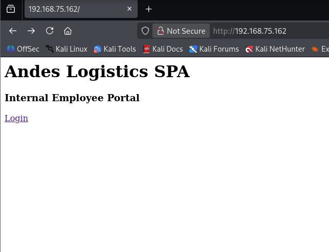
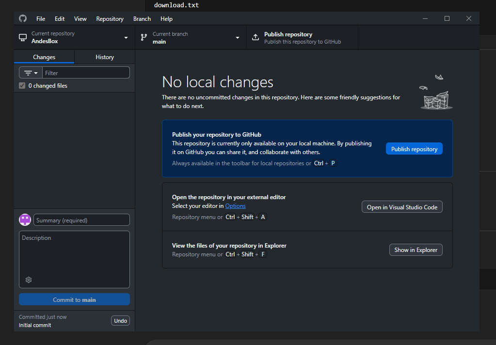
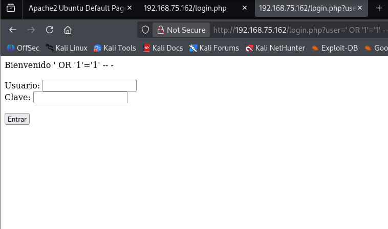
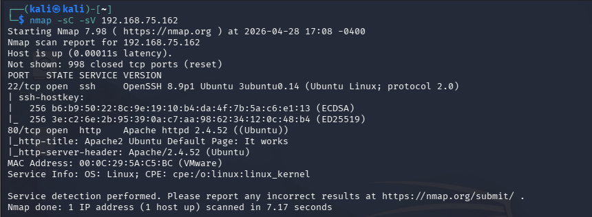
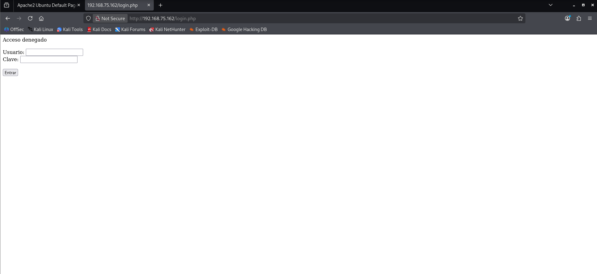
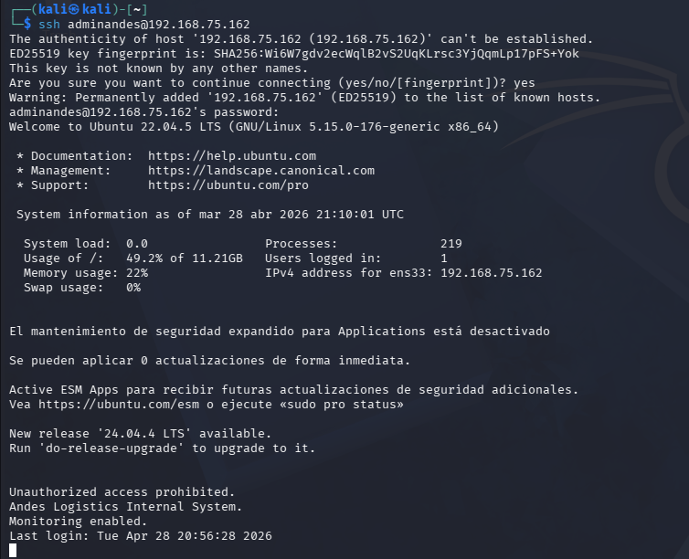

# AndesBox 1.0

## Vulnerable Linux Machine for Ethical Hacking Practice

## Máquina vulnerable Linux para práctica de hacking ético

---

## Overview / Descripción

**AndesBox** is a vulnerable Linux virtual machine created for cybersecurity students, beginners and enthusiasts who want to practice real attack techniques in a safe environment.

**AndesBox** es una máquina virtual Linux vulnerable creada para estudiantes de ciberseguridad, principiantes y entusiastas que deseen practicar técnicas reales de ataque en un entorno seguro.

---

## Scenario / Escenario

**Andes Logistics SPA** migrated internal services without proper security controls.
Its employee portal was exposed with weak authentication and exploitable vulnerabilities.

**Andes Logistics SPA** migró servicios internos sin controles adecuados de seguridad.
Su portal de empleados quedó expuesto con autenticación débil y vulnerabilidades explotables.

Your objective is to compromise the machine and capture all flags.
Tu objetivo será comprometer la máquina y capturar todas las flags.

---

## Skills Practiced / Habilidades

* Enumeration / Enumeración
* Web Discovery / Descubrimiento web
* SQL Injection
* Credential Reuse / Reutilización de credenciales
* SSH Access / Acceso SSH
* Linux Privilege Escalation / Escalada de privilegios
* Basic Post-Exploitation / Post-explotación básica

---

## Flags

* `user.txt`
* `root.txt`
* `bonus.txt`

---

## Machine Information

| Item            | Value               |
| --------------- | ------------------- |
| Name            | AndesBox            |
| OS              | Ubuntu Linux        |
| Difficulty      | Easy / Medium       |
| RAM Recommended | 2 GB                |
| Format          | OVA                 |
| Recommended VM  | VMware / VirtualBox |

---

## Featured Screenshot

### Root Access / Acceso Root

---

## Screenshots

### Login Portal

### Enumeration

### SQL Injection

### Initial Access

---

## Download / Descarga

Google Drive:
https://drive.google.com/drive/folders/1h8ycNeWJg-MTcscgauJZQMz5qrmCknL4?usp=drive_link

---

## Installation / Instalación

1. Download the `.ova` file / Descargar el archivo `.ova`
2. Import into VMware or VirtualBox / Importar en VMware o VirtualBox
3. Start the machine / Iniciar la máquina virtual
4. Identify the assigned IP / Identificar la IP asignada
5. Start attacking from Kali Linux / Comenzar pruebas desde Kali Linux

---

## Author / Autor

**CiberSecurity-H**

---

## Disclaimer / Aviso

This machine was created for educational purposes only. Use only in controlled or authorized environments.

Esta máquina fue creada únicamente con fines educativos. Utilizar solo en entornos controlados o autorizados.
